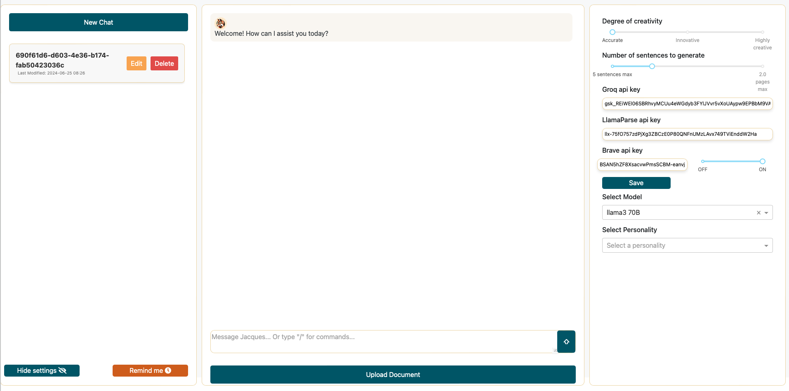
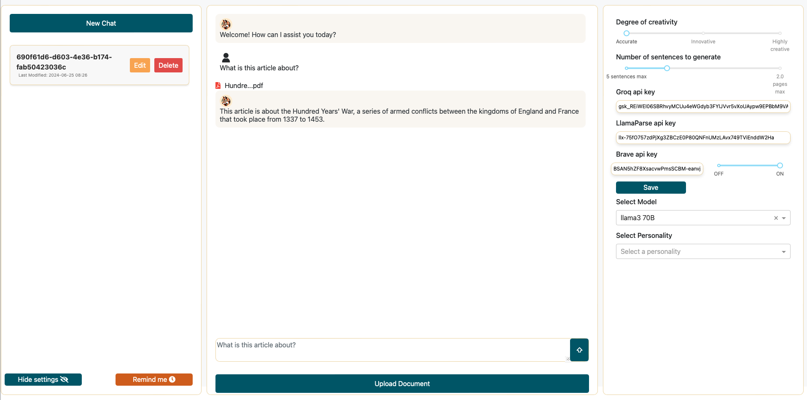
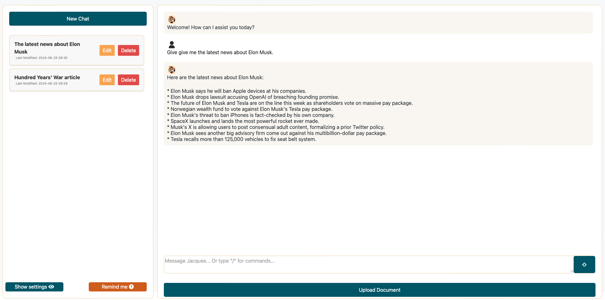
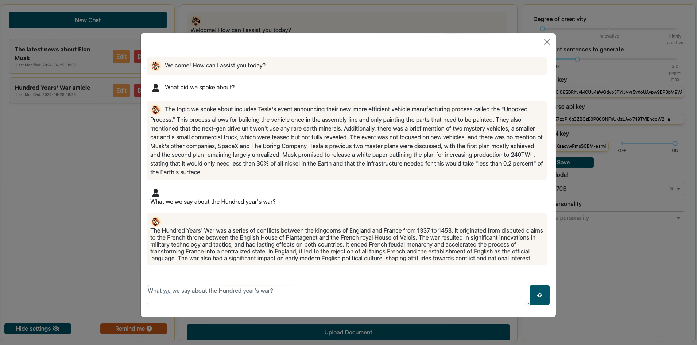

# JacQues: Your AI Assistant

**𝐉𝐚𝐜𝐐𝐮𝐞𝐬** is an AI agent web app designed to retrieve information and complete tasks, offering a seamless and intuitive experience across various domains.


## Screenshots






## Features

### 1. Multi-Modal Information Processing
- **Web Scraping**: JacQues can search the web for up-to-date information on any topic.
- **Document Analysis**: Efficiently process and extract insights from various file formats including PDFs, Word documents, presentations, and more.
- **Autonomous Agent**: JacQues adapts its approach based on the user's request, combining these sources as needed to deliver the most accurate and helpful response possible.

### 2. Adaptive Personality
- Customize JacQues' personality to suit your preferences or specific use cases.
- Choose from pre-defined personalities or create your own for a tailored experience.

### 3. Intelligent Conversation Management
- Maintain context across multiple chat sessions.
- Access a pop-up window that helps you recall information from different discussions without manually searching through chat history.

### 4. Advanced Language Model Integration
- Utilizes open-source language models available through GROQ's servers, including:
  - LLaMA 3
  - Mixtral
  - Gemma
- Balances performance and efficiency with state-of-the-art open-source models.

### 5. File Management
- Upload and manage documents directly within the chat interface.
- Seamlessly reference and analyze uploaded files during conversations.

### 6. Customizable Settings
- Adjust creativity levels and response lengths to fine-tune JacQues' outputs.
- Toggle internet access for real-time information retrieval.

### 7. Reminder System
- Set and manage reminders within conversations.
- JacQues can recall important information from previous chats.

### 8. API Integration
- Seamlessly integrates with Groq, LlamaParse, and Brave APIs for enhanced functionality.

## Technical Stack

- **Frontend**: Dash (Python-based web application framework)
- **Backend**: Python
- **APIs**: Groq, LlamaParse, Brave
- **File Processing**: Support for various document formats

## Getting Started

1. Clone the repository:
   ```
   git clone https://github.com/Antoine-Villiere/JacQues.git
   ```

2. Install dependencies:
   ```
   pip install -r requirements.txt
   ```

3. Set up your API keys in the settings panel:
   - Groq API Key : [Groq API](https://console.groq.com/keys)
   - LlamaParse API Key : [LlamaParse API](https://cloud.llamaindex.ai/login)
   - Brave API Key : [Brave API](https://brave.com/search/api/)

4. Run the application:
   ```
   python app.py
   ```

5. Open your browser and navigate to `http://localhost:8050` to start chatting with JacQues!

## Usage Examples

1. **Web Research**: 
   ```
   /web What are the latest developments in quantum computing?
   ```

2. **Document Analysis**:
   ```
   /data Summarize the key points from the uploaded financial report.
   ```

3. **Customizing Personality**:
   Use the settings panel to create or select a personality that suits your needs.

4. **Setting Reminders**:
   Click the reminder button and ask JacQues to remember important information.

## Contributing

Contributions to improve JacQues are welcome! While we don't have a formal CONTRIBUTING.md file yet, feel free to submit pull requests, report issues, or suggest enhancements through the GitHub repository.

## License

This project is open source and available under the [MIT License](https://opensource.org/licenses/MIT).

## Project Status
JacQues is an ongoing project with no current plans for major changes to its core functionality. The focus is on maintaining and improving the existing features. Users and contributors should be aware that while bug fixes and minor enhancements may be implemented, significant alterations to the project's scope or direction are not planned at this time.

## ⚠️ Important Warning
Please be aware that JacQues, like all AI systems, has limitations:

- **Potential Inaccuracie**s: JacQues may sometimes provide inaccurate or incorrect information. Always verify critical information from reliable sources.
- **No Fact-Checking**: The system does not have built-in fact-checking capabilities. Use your judgment when interpreting responses.
- **Limited Context**: While JacQues attempts to maintain context, it may not always fully understand the nuances of complex queries or situations.
- **Evolving Technology**: As an open-source project, JacQues is continuously evolving. Features and capabilities may change over time.
- **Not for Critical Decisions**: Do not rely solely on JacQues for making important decisions, especially in areas like health, finance, or legal matters.
- **Do not share sensitive information**: While no information is shared with the owner of the project, the use of external services necessary for the good work of the AI (Groq, LlamaParse, and Brave) makes it recommended not to share any sensitive information.
